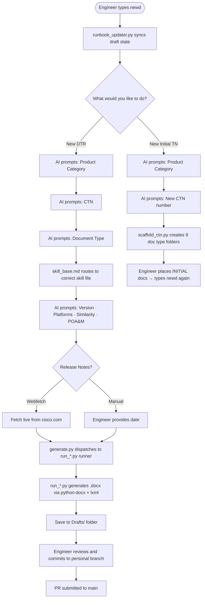

# ICR Documentation Automation


> AI-assisted document generation for Cisco Internal Compliance Review (ICR) submissions across multiple product categories and software release cycles.

---

## Before vs. After

| | Manual Process | With ICR Automation |
|---|---|---|
| Time per DTR document | 30–60 min per doc | ~30 seconds |
| Risk of formatting errors | High — copy/paste from prior versions | Eliminated — XML-level generation |
| Release notes | Manually searched and copied | Auto-webfetched from `cisco.com` |
| Revision history | Manually updated | Auto-incremented and normalized |
| Consistency across engineers | Depends on individual | Identical output on any machine |
| Version tracking | Ad hoc | Git-controlled, branch per engineer |
| Similarity & POA&M statements | Manually typed each time | Prompted and formatted automatically |

---

## What This Is

The ICR process requires a suite of up to 9 formal documents for every Desktop Review (DTR) cycle across each certified product. These documents track software versions, compliance status, test discrepancies, and deployment guidance — and they must be updated incrementally with every new software release.

This project automates that process. Engineers use an AI assistant (OpenCode) to generate accurate, consistently formatted DTR drafts in seconds — instead of manually editing Word files across multiple document types for every release cycle.

---

## Metrics

```
3 product categories   ·   9 document types   ·   27 doc-type subfolders (3 CTNs × 9 types)   ·   ~30 seconds per draft
```

---

## How It Works



---

## Repository Structure

```
ICR_Automation/
├── _Runbook/                          ← Engineer operational wiki
│   ├── ICR_Automation_Runbook.md      ← Full session guide, known issues, decisions log
│   ├── runbook_updater.py             ← Auto-runs on newd to sync draft state
│   ├── runbook_updater_launcher.sh    ← Shell wrapper for launchd auto-run on login
│   ├── com.icr.runbook_updater.plist  ← launchd job definition
│   ├── runbook_updater.log            ← stdout log
│   ├── runbook_updater_error.log      ← stderr log
│   └── Backup/                        ← Auto-timestamped runbook backups
│
├── _Skills/                           ← AI instruction files (one per document type)
│   ├── skill_base.md                  ← Shared rules, prompt sequence, document type router
│   ├── skill_system_description.md    ← System Description (fully built)
│   ├── skill_csr.md                   ← Cybersecurity Summary Report (fully built, DTR001 on disk)
│   ├── skill_fa.md                    ← Functionality Attestation (fully built)
│   ├── skill_icr_memo.md              ← ICR Summary Memorandum (fully built)
│   ├── skill_loc.md                   ← Letter Of Compliance (scaffolded)
│   ├── skill_mudg.md                  ← Military Unique Deployment Guide (fully built)
│   ├── skill_poam.md                  ← Plan of Action & Milestone (fully built)
│   ├── skill_system_diagram.md        ← System Diagram (scaffolded)
│   └── skill_tdr.md                   ← Test Discrepancy Report (fully built)
│
├── _Tools/                            ← Shared Python scripts (see Script Inventory in Runbook for full list)
│   ├── generate.py                    ← newd dispatcher — routes to run_*.py runners
│   ├── runner_core.py                 ← Shared utilities imported by all runners
│   ├── run_sysdesc.py                 ← System Description runner
│   ├── run_fa.py                      ← Functionality Attestation runner
│   ├── run_icr_memo.py                ← ICR Memo runner
│   ├── run_mudg.py                    ← MUDG runner
│   ├── run_tdr.py                     ← TDR runner
│   ├── run_csr.py                     ← CSR runner (DTR001 on disk, DTR002 pending)
│   ├── run_loc.py                     ← LoC skeleton runner (pending example docs)
│   ├── run_poam.py                    ← POA&M runner ✅ complete (template-based, all inputs prompted)
│   ├── run_system_diagram.py          ← System Diagram skeleton runner (VSDX on disk — runner implementation pending)
│   ├── finalize_doc.py                ← Draft → Final .docx + PDF generator
│   ├── validate_doc.py                ← Post-generation document linter
│   ├── scaffold_ctn.py                ← Creates standard folder structure for a new CTN
│   └── trim_backups.py                ← Manual runbook backup trimmer
│
└── Product Category/                  ← All working documents organized by product
    ├── ESC/
    │   └── CTN2026001/
    ├── SBC/
    │   └── CTN2026003/
    └── SS/
        └── CTN2026002/
            └── [Each CTN contains 9 document type folders]
                └── [Each folder contains Drafts/ and Examples & Templates/]
```

---

## Document Types

| # | Document Type | Abbr | Skill Status |
|---|---|---|---|
| 1 | System Description | — |  |
| 2 | Cybersecurity Summary Report | CSR |  |
| 3 | Functionality Attestation | FA |  |
| 4 | ICR Summary Memorandum | ICR Memo |  |
| 5 | Letter Of Compliance | LoC |  |
| 6 | Military Unique Deployment Guide | MUDG |  |
| 7 | Plan of Action & Milestone | POA&M |  |
| 8 | System Diagram | — |  |
| 9 | Test Discrepancy Report | TDR |  |

> A **Scaffolded** skill has the structure in place but requires an example document placed in `Examples & Templates/` before full automation is available.

---

## Product Categories & CTNs

| Product Category | CTN | Status |
|---|---|---|
| ESC | CTN2026001 | Folder structure ready, no docs placed yet |
| SBC | CTN2026003 |  System Description: DTR001 finalized, no drafts on disk; FA: no drafts on disk, next=DTR001; ICR Memo DTR001–DTR002 on disk, next=DTR003; MUDG: no drafts on disk, next=DTR005; CSR: no drafts on disk, next=DTR001; TDR DTR001 (TDR26003-02) + DTR003 (TDR26003-03) on disk |
| SS | CTN2026002 | Folder structure ready, no docs placed yet |

---

## Branch Strategy

| Branch | Owner | Purpose |
|---|---|---|
| `main` | Project Lead | Source of truth — protected |
| `edknowlt` | Ed Knowlton | Lead engineer working branch |
| `jmisal` | jmisal | Engineer working branch |
| `nateric` | nateric | Engineer working branch |

Each engineer works on their own branch and submits a pull request to `main` when a draft is approved and ready.

---

## Getting Started

<details>
<summary><strong>Prerequisites</strong></summary>

- Python 3.x
- `python-docx`: `pip install python-docx`
- `lxml`: `pip install lxml`
- `pypdf`: `pip install pypdf` (for PDF signature field injection)
- `vsdx`: `pip install vsdx` (for System Diagram .vsdx editing)
- OpenCode AI assistant

> Or install all dependencies at once: `pip install -r requirements.txt`

</details>

<details>
<summary><strong>First-Time Setup</strong></summary>

```bash
# 1. Clone the repo (Mac Terminal)
#    Note: the remote repo name uses a hyphen (ICR-Automation) but we clone into
#    a local folder with an underscore (ICR_Automation) — this is intentional.
#    All internal paths and skill files expect the underscore folder name.
cd ~/Documents
git clone https://wwwin-github.cisco.com/GCT-DP-Collaboration/ICR-Automation.git ICR_Automation
cd ICR_Automation

# 2. Checkout your personal branch (already created for you)
git checkout [your-github-username]

# 3. Open OpenCode
opencode
```

Then paste this as your first message in OpenCode every session:
```
Read _Skills/skill_base.md and _Runbook/ICR_Automation_Runbook.md in full from disk before responding to anything.
```

> This is mandatory — the AI must read both files from disk before answering any question or taking any action. If it responds without reading first, that is a protocol violation. Correct it by asking the AI to read both files and re-answer.

> The Document Type Router in `skill_base.md` automatically loads the correct doc-type skill file (e.g. `skill_system_description.md`) when you select a document type during the `newd` prompt sequence — you do not need to load it manually.

</details>

<details>
<summary><strong>Every Session After First Time</strong></summary>

```bash
# Pull latest from your branch (Mac Terminal)
git -C ~/Documents/ICR_Automation pull origin [your-github-username]

# Open OpenCode
opencode
```

Then load skills as above, and type `newd` to begin.

> **Tip:** Paste the mandatory read message first — the AI must read both files from disk before responding to anything. The correct doc-type skill loads automatically when you select a document type.

</details>

---

## Key Shortcuts

> The authoritative shortcut table is in `_Skills/skill_base.md` → **Shortcut Commands**. The list below is a summary only — if there is a discrepancy, `skill_base.md` wins.

| Shortcut | Action |
|---|---|
| `newd` | Begin DTR generation — auto-syncs runbook first, then starts prompt sequence |
| `new dtr` | Same as `newd` — alternate trigger |
| `finalize` | Finalize a draft — generates Final .docx + PDF with signature field |
| `prnts` | Print live folder structure |
| `myb` | Show current git branch name |
| `cm1` | Commit and push all staged changes to `main` (requires confirmation) |
| `sbh` | Show branch health — ahead/behind status for all branches vs main |
| `sync` | Sync `edknowlt` with `origin/main` — push, pull, push |
| `/adt` | Run full audit — scans all scripts and markdown for bugs, stale refs, dirty code |
| `qac` | Same as `/adt` — alternate trigger for full audit |

---

## Skills

Skills are Markdown instruction files that tell the AI exactly how to generate each document type. They are the engine behind consistent output across all engineers and machines.

- **`skill_base.md`** — loaded first every session. Contains the prompt sequence, folder rules, file naming conventions, revision history standards, and the **Document Type Router** (automatically loads the correct doc-type skill when a document type is selected).
- **`skill_[doctype].md`** — loaded automatically when that document type is selected. Contains the unique structure, table layout, paragraph patterns, and generation logic for that specific document.

### OpenCode + Anthropic Skill Integration

This project uses OpenCode's built-in skill system powered by Anthropic Claude. Skill files (`.md`) are plain Markdown documents loaded directly into the AI's context at the start of a session. Once loaded, the AI treats the skill content as authoritative instructions for the entire session — no re-prompting required.

The skill architecture is two-layered:
- **`skill_base.md`** — shared across all document types; loaded every session
- **`skill_[doctype].md`** — loaded automatically when a specific document type is selected in the prompt sequence

Any engineer on any machine gets identical generation behavior as long as they load the correct skill files — the AI's output is fully determined by the skill content, not by tribal knowledge or manual prompting.

### Building Out a Scaffolded Skill

<details>
<summary>Steps to activate a scaffolded skill</summary>

1. Place an example `.docx` in the document type's `Examples & Templates/` folder
2. Name it: `Example_CTN[number] - DTR[###] - [ProdCat] - [Version] - Cisco ICR [DocType].docx`
3. Open a session with OpenCode and say: *"Let's build out the [DocType] skill"*
4. AI will extract the structure, update the skill file, and mark the Generation Status checklist complete

</details>

---

## Generation Rules

<details>
<summary><strong>System Description — key rules enforced on every generated document</strong></summary>

- **Platforms being sustained** (not updating) get a sustain paragraph only — no release notes entry
- **Release notes** are webfetched live from `cisco.com` for updating platforms — only official Cisco URLs, rendered as clickable hyperlinks with short labels
- **Similarity statements** reference a typically different CTN than the one being worked
- **POA&M statements** follow the exact format: `This DTR Clears POA&M/TDR Number: [NUMBER], [PROBLEM DESCRIPTION].`
- **Revision history** dates are always 3-letter abbreviated month + year (e.g. `Apr 2026`)
- **Page breaks** are applied per spec: each DTR heading and Management Description start on a new page; the component table flows freely
- **Notes list** in every DTR component table restarts at `1.` using `w:lvlOverride` + `w:startOverride`

</details>

---

## File Naming Conventions

| Type | Pattern |
|---|---|
| Initial document | `CTN[number] - DTR000 - INITIAL - [ProdCat] - Cisco ICR [DocType].docx` |
| Generated draft | `Draft_CTN[number] - DTR[###] - [ProdCat] - [Version] - Cisco ICR [DocType].docx` |
| Example (reference only) | `Example_CTN[number] - DTR[###] - [ProdCat] - [Version] - Cisco ICR [DocType].docx` |
| Template (reference only) | `Template_CTN0000000 - DTR000 - [ProdCat] - Cisco ICR [DocType].docx` |

> `Example_*` and `Template_*` files are **never** used as source documents. Only `CTN*` and `Draft_*` files are used as generation sources.

---

## Runbook

The full engineer runbook lives at `_Runbook/ICR_Automation_Runbook.md`. It contains:
- Session log
- Platform version history
- Pending DTR tracker
- Known issues and gotchas
- Complete prompt order reference
- DTR generation logic
- Release notes webfetch reference
- Key decisions log

### Example: Prompt Order (Every New DTR)

<details>
<summary>See the full 9-step prompt sequence</summary>

Every DTR generation follows this exact order — the AI reads folder names live at each step so the options are always current:

**First — choose a path:**
- **New DTR** — increment an existing CTN
- **New Initial TN** — brand new TN, scaffolds folders and stops for INITIAL doc placement

**New DTR path:**
1. **Product Category** — read live from `Product Category/` subfolders (e.g. `ESC`, `SBC`, `SS`), plus **"+ New Product Category"**
2. **CTN** — read live from subfolders under chosen Product Category, plus **"+ New CTN"** (auto-runs `scaffold_ctn.py`)
3. **Document Type** — read live from subfolders under chosen CTN
4. **IOS XE Version** — new version being certified
5. **All components updating?** — Yes / No
6. **If No** — per-platform keep/update prompt for each platform (shows current version)
7. **Similarity statement?** — Yes / No
   - If Yes: TN Product Category (live) → TN CTN (live) → DTR number (manual)
   - Output: `Request certification through similarity based on "[ProdCat] TN: [CTN], DTR[XX]."`
8. **POA&M?** — Yes / No
   - If Yes: POA&M/TDR Number (manual) → Problem Description (manual)
   - Output: `This DTR Clears POA&M/TDR Number: [NUMBER], [PROBLEM DESCRIPTION].`
9. **Release Notes** — clickable offer to webfetch live from `cisco.com`, or enter expected date manually

</details>

### Example: Known Issues & Resolutions

<details>
<summary>See the technical gotchas log</summary>

Hard-won fixes accumulated during development — each one represents a real issue encountered and solved:

| # | Issue | Resolution |
|---|---|---|
| 1 | DTR000 INITIAL doc has 11-row table with `IWBC` naming — wrong structure for DTR001+ | Preserve INITIAL table. Clone 14-row table from Example DTR001 and insert full DTR section after it |
| 2 | Notes list numbering doesn't restart at `1.` across tables | Create new `w:num` with `w:lvlOverride` + `w:startOverride val=1` and unique `numId` per table |
| 3 | `Example_*` and `Template_*` files look like source docs but are reference only | Only use files starting with `CTN*` or `Draft_*` as generation source |
| 4 | Version downgrades are valid (e.g. 27.0 → 26.9) | Always confirm with engineer before proceeding when new version < current |
| 5 | Multiple platforms updating from different versions need separate paragraphs | Group by `(from_ver, to_ver)` tuple — one paragraph per unique pair |
| 6 | New DTR headings render at wrong size | Clone full `w:rPr` from source run — never build bare runs without run properties |
| 7 | Detail heading doubles text when cloned from example | Example heading has 3 runs — set text in run 0 only, blank all others |
| 8 | TOC and System Description heading don't start on new page | Insert empty paragraph with `w:pageBreakBefore` before `<sdt>` TOC block at generation time |

</details>

---

## Contributing

1. Check out your engineer branch
2. Generate or edit documents
3. Commit your changes with a clear message
4. Open a pull request to `main`
5. PR reviewed and merged by project lead

---

*Maintained by GCT DP Collaboration*
